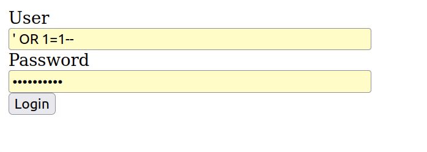

# Analyzing a Compromised Linux Machine
## Introduction
In this project, we performed a comprehensive security analysis on a Linux machine as part of our CPRE 230 final project. The objective was to identify, analyze, and provide recommendations to mitigate various vulnerabilities found on the target system. By leveraging a combination of manual inspection and automated tools, we were able to uncover several critical security issues that could potentially be exploited by malicious actors.
## Table of Contents
- [Introduction](#introduction)
- [Vulnerabilities and Findings](#vulnerabilities-and-findings)
    - [SQLi at /login.php](#1-sqli-at-loginphp)
    - [Stored XSS at /profile.php](#2-stored-xss-at-profilephp)
    - [User ‘backdoor’ on the server with root access](#3-user-backdoor-on-the-server-with-root-access)
    - [FTP anonymous login allowed](#4-ftp-anonymous-login-allowed)
    - [Telnet shell open at port 23 vulnerable to multiple attacks](#5-telnet-shell-open-at-port-23-vulnerable-to-multiple-attacks)
    - [Fingerd exposed](#6-fingerd-exposed)
    - [/var/www/html/vars.inc is publicly accessible through the webserver](#7-var-www-html-vars-inc-is-publicly-accessible-through-the-webserver)
    - [Port 1337 hosts a root-level shell](#8-port-1337-hosts-a-root-level-shell)
- [Methodology](#methodology)

The following sections detail each vulnerability identified, the potential harm it could cause, proof-of-concept (PoC) demonstrations, and recommended fixes. This analysis aims to enhance our understanding of common security flaws and improve our skills in identifying and mitigating such vulnerabilities in real-world scenarios.

## Vulnerabilities and Findings

#### 1. SQLi at /login.php

**PoC**: Enter username and password as `‘ OR 1=1 –`

**PoC Explanation**: This works because the expression `OR 1=1` always evaluates as true, `‘` is used to escape from the username, and `–` makes the rest of the query a comment.

**Impact**: A malicious user could authenticate without credentials and gain unauthorized access.

**Advisory**: In `/var/www/html/connect.php`, on line 15, either have sufficient checks in place to prevent SQLi or use PDO instead of `mysqli_query` (recommended).


---
#### 2. Stored XSS at /profile.php

**PoC**: Enter `<script>alert(1)</script>` as the name or the post and submit it.

**PoC Explanation**: There should be a pop-up executed right afterwards.

**Impact**: A malicious user could insert JavaScript code, which could be used to capture users’ cookies or perform actions as them.

**Advisory**: In `/var/www/html/action.php`, on line 5, either implement checks to ensure users cannot insert JS code or sanitize the input from `comments.txt` on `profile.php` before it gets executed (preferred).

---
#### 3. User ‘backdoor’ on the server with root access

**PoC**: See `/etc/passwd` to find an entry for the user `backdoor`. Use `su backdoor` to log in as the backdoor user and `sudo -l` or `whoami` to verify root access.

**Impact**: A malicious actor has created an account `backdoor` with root-level access. They can log in, modify/delete files, or execute any programs without a password, making root access open to any attacker looking to escalate privileges.

**Advisory**: Delete the user and check user permissions for all users on the system to ensure a user cannot create another backdoor.

---
#### 4. FTP anonymous login allowed

**PoC**: Log in using an FTP client or the terminal using `ftp 192.168.1.101`. For the username and password, enter `anonymous`.

**Impact**: Anyone can access all the files on the system without an account or login credentials.

**Advisory**: Disable anonymous FTP login and switch to SFTP to prevent credential sniffing attacks.

---
#### 5. Telnet shell open at port 23 vulnerable to multiple attacks

**PoC Explanation**: Telnet is insecure. It does not encrypt information, allowing malicious attackers on the same network to sniff credentials. They can also log into the system using the `backdoor` user without a password, making root access vulnerable to brute-force attacks.

**Impact**: Credential sniffing, unauthorized access via the `backdoor` account, and brute-forcing credentials.

**Advisory**: Switch from Telnet to SSH.

**Note**: “Telnet is inherently insecure. Credential information (usernames and passwords) submitted through telnet is not encrypted and is therefore vulnerable to identity theft. Users can establish a Secure Shell connection instead to prevent this type of intrusion.” 

Source: [Missouri S&T Secure Telnet Policy](https://it.mst.edu/policies/secure-telnet/)

---
#### 6. Fingerd exposed

**PoC**: Go to a terminal and type `finger <username>@192.168.1.101`.

**Impact**: Finger exposes user and system information, allowing enumeration of users. It shows the name, last login, home directory, shell, new email, and a file called `.plan` in the home directory.

**Advisory**: Disable `fingerd` or, if essential, restrict access. To block username enumeration, limit `fingerd` attempts by any given IP.

---
#### 7. /var/www/html/vars.inc is publicly accessible through the webserver

**Impact**: `vars.inc` contains the database name, username, host, and password.

**Advisory**: Edit `.htaccess` to limit access to `vars.inc`.

---
#### 8. Port 1337 hosts a root-level shell

**PoC**: Go to a terminal and type `nc 192.168.1.101 1337`.

**Impact**: This is a root-level shell without any password, meaning anyone connecting to the port can modify, delete, or run any files on the system.

**Advisory**: Close the service on port 1337.

## Methodology
### NMAP Results

To begin our analysis, we performed a comprehensive scan of the target machine using Nmap. The command used was:

`nmap -sC -sV 192.168.1.101 -p-`

The scan revealed the following open ports and services:

*[Results Edited for better readability]*
```
PORT STATE SERVICE VERSION
21/tcp open ftp vsftpd 2.0.8 or later
| ftp-anon: Anonymous FTP login allowed (FTP code 230)
| drwxr-xr-x 103 0 12288 Apr 27 11:35 fun_files
| drwxrwxrwx 3 0 4996 Oct 14 2017 hacks_here [NSE: writeable]
| drwxrwxrwx 2 0 4996 Oct 14 2017 irc_chat_here_too [NSE: writeable]
| drwxrwxrwx 2 0 4996 Oct 14 2017 vulns_here [NSE: writeable]
| drwxr-xr-x 23 0 4996 Aug 17 2019 whats_in_here [NSE: writeable]
|
| vsFTPd 3.0.3 - secure, fast, stable
| End of status

23/tcp open telnet Linux telnetd

25/tcp open smtp Postfix smtpd
|_smtp-commands: capstone, PIPELINING, SIZE 10240000, VRFY, ETRN, ENHANCEDSTATUSCODES, 8BITMIME, DSN,

79/tcp open finger Debian fingerd
| finger: Login Name Tty Idle Login Time Office Office Phone\x0D
| cpre230 cpre230 * tty1 3 Apr 29 19:35\x0D

80/tcp open http Apache httpd 2.4.29 ((Ubuntu))
|_http-server-header: Apache/2.4.29 (Ubuntu)
|_http-title: Flat UI Login

1337/tcp open tcpwrapped

14580/tcp open ssh OpenSSH 7.6p1 Ubuntu 4ubuntu0.3 (Ubuntu Linux; protocol 2.0)
| ssh-hostkey:
| 2048 [Redacted] (RSA)
| 256 [Redacted] (ECDSA)
| 256 [Redacted](ED25519)
|_
Service Info: Host: capstone; OS: Linux; CPE: cpe:/o:linux:linux_kernel
```
Based on the Nmap scan results, we identified several vulnerabilities on the target machine:

## Finding 1: SQL Injection

After a thorough examination of the target machine, we discovered that the login page of the web application allows SQL injection. This can be exploited by injecting malicious SQL queries into the username or password fields.

Link: http://192.168.1.101/login.php

Payload: ' OR 1=1 --





This happens due to incorrect sanitization of user input. 

## Finding 2: Stored XSS

Digging more into the webserver, it appears that the profile page is vulnerable to stored XSS.

Link: http://192.168.1.101/profile.php

Payload: `<script>alert(1)</script>`


## Finding 3: incorrect .htaccess permissions
Link: http://192.168.1.101/vars.inc

The file vars.inc is publicly accessible through the web server. This file contains sensitive information such as database credentials and should not be exposed to unauthorized users.


## Finding 4: backdoor user

File: /etc/passwd

The `/etc/passwd` file contains all users on the system. Upon analysis, we found that there exists a user named `backdoor` with root-level access.

commands:
```
su backdoor
sudo -l 
whoami
```


## Finding 5: telnet access

From the NMAP scan earlier we identified that port 23 is open on the target machine. This port is used for remote login and communication over Telnet.

Telnet is an insecure protocol used for remote login and communication over a network. It is known for transmitting data, including usernames and passwords, in plain text. In this case, Telnet is accessible on port 23 of the target machine, which poses significant security risks.

commands: `telnet 192.168.1.101 23`


Telnet's inherent lack of encryption makes it susceptible to several types of attacks:

- Credential Sniffing: An attacker on the same network can capture Telnet traffic using tools like Wireshark, allowing them to read the transmitted credentials.
- Unauthorized Access: If the "backdoor" account discovered earlier is used in combination with Telnet, an attacker can gain root-level access without a password.
- Brute Force Attacks: Telnet does not implement robust mechanisms to prevent brute force attacks, making it easier for attackers to guess credentials.

## Finding 6: fingerd exposure

The fingerd service is running on the target machine, accessible on port 79. This service provides information about users on the system, including their names, login times, and more. While useful in some contexts, it can be leveraged by attackers for reconnaissance purposes.


NMAP has discovered the user `cpre230` on the target machine.

## Finding 7: FTP anonymous Login
The FTP service on the target machine allows anonymous login. This means that users can access the FTP server without providing any authentication credentials, simply by using the username "anonymous" and any password (often set as an email address or simply "anonymous"). This configuration poses significant security risks as it grants unrestricted access to the server's files and directories.

command: `ftp 192.168.1.101`

```
username: anonymous

password: anonymous
```


## Finding 8: 1337 port

For the last finding, we found a root-level shell on port 1337. It is a backdoor that allows users to modify, delete, or run any files on the system.

command: `nc 192.168.1.101 1337`

